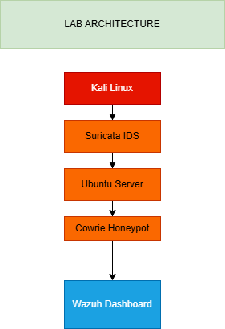
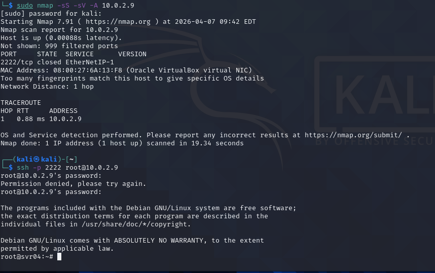
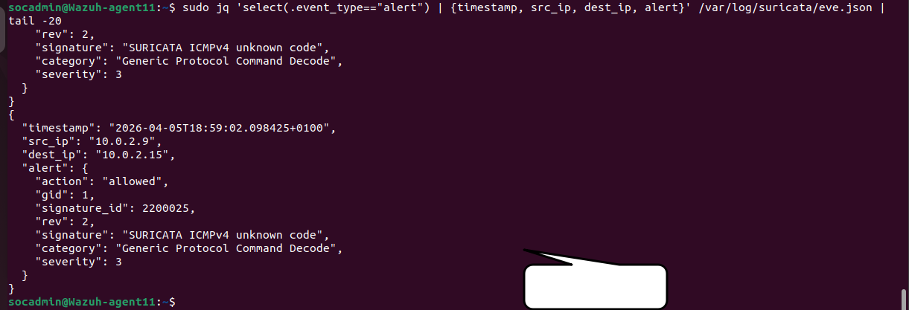
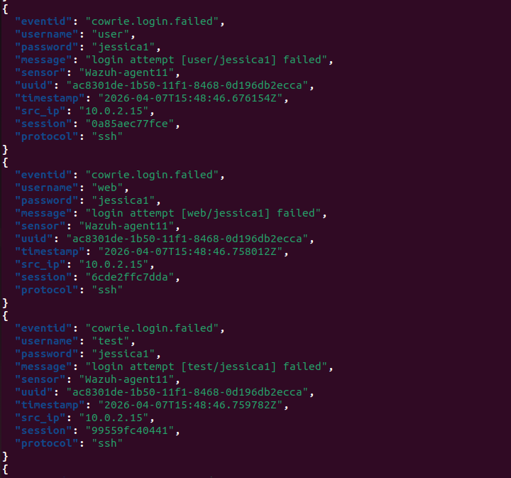
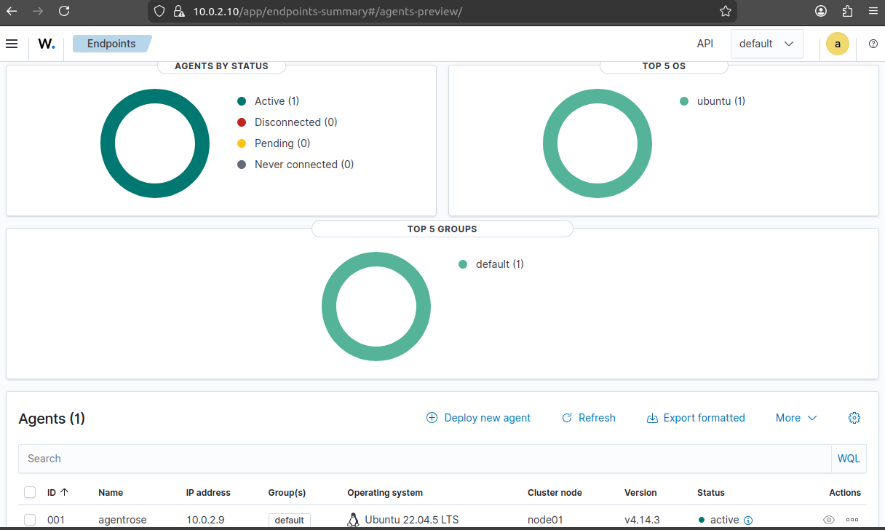
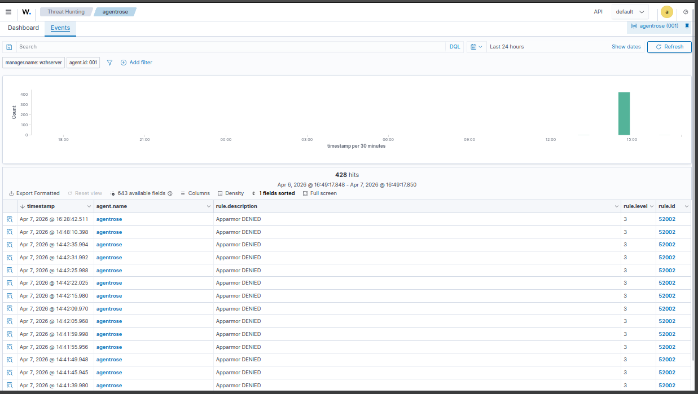
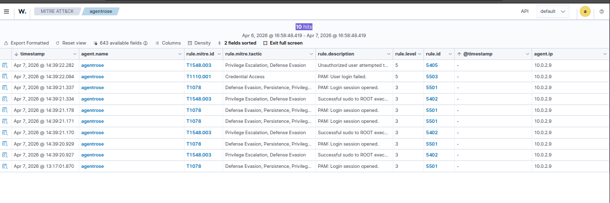

# Blue Team Detection Lab — SOC Monitoring & Detection Engineering

A practical, end-to-end Security Operations Center (SOC) lab simulating real-world detection, alert correlation, and incident analysis using multi-layer telemetry.

This project demonstrates how attacker activity can be:
- detected at the network layer (Suricata)
- observed at the application layer (Cowrie honeypot)
- correlated through SIEM pipelines (Wazuh / Splunk)

Built under constrained conditions, this lab reflects realistic environments where visibility, tooling, and response capabilities must be engineered not assumed.

It has been further extended to align with cybersecurity frameworks (MITRE ATT&CK, NIST CSF, NCPS) and simulate compliance-driven detection workflows.

 

## Table of Contents

- [Overview](#overview)
- [Objectives](#objectives)
- [Lab Architecture](#lab-architecture)
- [Architecture Diagram](#architecture-diagram)
- [Tools Used](#tools-used)
- [Attack Scenario](#attack-scenario)
- [Detection & Analysis](#detection--analysis)
- [Screenshots](#screenshots)
- [MITRE ATT&CK Mapping](#mitre-attck-mapping)
- [Key Skills Demonstrated](#key-skills-demonstrated)
- [Why This Matters](#why-this-matters)
- [Resume-Ready Highlights](#resume-ready-highlights)
- [License](#license)

## What This Demonstrates

- Real-world IDS deployment (Suricata) with correct interface binding
- SSH honeypot deployment (Cowrie) using least-privilege isolation
- Controlled attack simulation from Kali Linux
- Cross-layer correlation using raw logs and jq (no SIEM shortcuts)
  

## Overview

This project documents the design and implementation of a Blue Team detection lab
focused on network intrusion detection, attacker behavior monitoring, and
cross-layer alert correlation.

The lab was built under constrained conditions (limited internet access and partial
offline operation), mirroring real-world SOC and on-prem defensive environments
where tooling, updates, and visibility are not always ideal.

---

## Objectives

- Deploy and tune Suricata for network-based intrusion detection
- Simulate attacker activity using Kali Linux
- Capture and analyze alerts using structured logs (EVE JSON)
- Deploy a Cowrie SSH honeypot to observe attacker behavior
- Practice detection engineering and alert triage
- Correlate network-level alerts with application-level attacker activity

---

## Lab Architecture

- **Attacker:** Kali Linux  
- **Defender / Sensor:** Ubuntu Server  
- **IDS:** Suricata (network layer detection)  
- **Honeypot:** Cowrie (SSH deception service)  
- **Network:** Host-Only Adapter (isolated lab environment)

## Architecture Diagram

Traffic generated by the attacker is inspected by Suricata at the network layer
and simultaneously captured by Cowrie at the application layer, enabling
multi-layer visibility of the same adversarial activity.

---

## Attack Scenario

- Controlled SSH brute-force attempts were initiated from Kali Linux
- Attacks targeted the Cowrie SSH service (port 2222)
- Password attempts were intentionally limited to preserve clean signal
- Source IP and timestamps were used to correlate events across systems

---

## Detection & Analysis

### Suricata (Network Layer)
- Inspected live traffic on the primary network interface
- Generated alerts for SSH scanning and brute-force behavior
- Logged structured events to `eve.json` for analysis

### Cowrie (Application Layer)
- Recorded attacker connection attempts and failed logins
- Logged detailed session metadata including:
  - Source IP
  - Username
  - Password attempts
  - Timestamps

### Correlation Approach
- Logs were parsed directly using `jq`
- Events were correlated manually using:
  - Source IP address
  - Timestamp proximity
- This confirmed that both Suricata and Cowrie observed the same malicious activity
  across different telemetry layers

---
---

## Screenshots

### Attack Simulation (Kali Linux)

Simulated SSH brute-force activity from Kali Linux targeting Cowrie honeypot.

---

### Suricata Detection Alerts

Suricata generated alerts from detected SSH brute-force activity.

---

### Cowrie Honeypot Activity

Cowrie captured attacker login attempts and session activity.

---

### Wazuh Agent Monitoring

Wazuh agent monitoring endpoint visibility and system telemetry.

---

### Wazuh Security Events

Security alerts aggregated and analyzed through Wazuh SIEM.

---

## 🇳🇬 NITDA Compliance Simulation

### Context
Following NITDA's cybersecurity directive requiring MDAs to strengthen detection, monitoring, and incident response capabilities, this lab has been extended to simulate real-world compliance aligned with national and global frameworks.

---

### Frameworks Addressed

| Framework       | Purpose                     | Coverage                                   |
|----------------|----------------------------|--------------------------------------------|
| NIST CSF       | Security lifecycle          | Detection + response workflows             |
| MITRE ATT&CK   | Adversary behavior          | SSH brute-force, privilege escalation      |
| MITRE D3FEND   | Defensive countermeasures   | Honeypot deception, network isolation      |
| MITRE F3       | Fraud & abuse scenarios     | Credential abuse, account takeover         |
| NCPS 2021      | National policy             | Monitoring, logging, IR alignment          |

---

### Architecture Alignment

- **Suricata** → Network detection *(NIST DE.CM, NCPS monitoring)*  
- **Cowrie** → Deception telemetry *(MITRE D3FEND: Decoy Systems)*  
- **Wazuh** → Log aggregation & correlation *(NIST DE.AE)*  
- **Splunk** → Enterprise SIEM visibility *(Centralized logging requirement)*  
- **n8n** → Automated response workflows *(NIST RS.RP)*  

---

### What This Demonstrates

- Detection engineering aligned with real compliance requirements  
- Cross-layer telemetry correlation *(network + application + SIEM)*  
- Practical implementation of SOC monitoring pipelines  
- Mapping of **attacks → detections → frameworks → response**

See the [`compliance`](./compliance/) folder for framework-aligned detection mappings. 

### MITRE ATT&CK Detection Mapping

Detection events mapped to MITRE ATT&CK techniques.

---

## MITRE ATT&CK Mapping

Observed activity mapped to the following techniques:

- **T1110** — Brute Force  
- **T1021.004** — Remote Services: SSH  
- **T1548.003** — Privilege Escalation  
- **T1078** — Valid Accounts  
- **T1110.001** — Password Guessing  

These detections were validated through Wazuh SIEM correlation and multi-layer telemetry analysis.

---

## Key Skills Demonstrated

- Network security monitoring
- Intrusion Detection Systems (IDS)
- Honeypot deployment and isolation
- Linux system administration
- Alert analysis and structured log parsing (`jq`)
- Blue team operational thinking
- Detection validation and signal correlation

---

## Tools Used

- Suricata
- Cowrie
- Nmap
- jq
- Linux (Ubuntu, Kali)
- VirtualBox

---

## SOC Workflow Demonstrated

1. Attack Simulation
2. Network Detection (Suricata)
3. Application Detection (Cowrie)
4. SIEM Correlation (Wazuh)
5. MITRE ATT&CK Mapping
6. Detection Validation
This workflow mirrors real-world SOC operations and detection engineering processes.

---

## Why This Matters

*  This lab simulates real SOC workflows including detection, alert validation,
and attacker observation under constrained conditions. It emphasizes
decision-making, signal validation, and operational realism beyond
theoretical or tool-only learning.

+  This lab is one layer of a broader security engineering portfolio spanning endpoint detection, cloud security posture management, and AI-powered threat intelligence automation."

---
## Resume-Ready Highlights

- Built a Blue Team detection lab using Suricata IDS and Cowrie honeypot
- Simulated attacker behavior using Kali Linux in isolated environment
- Detected SSH brute-force attempts using Suricata network telemetry
- Captured attacker session activity using Cowrie honeypot
- Performed cross-layer correlation using structured logs and jq
- Mapped observed activity to MITRE ATT&CK techniques
- Documented detection workflows and investigation procedures
- Designed SOC-style monitoring environment using open-source tools

## License

This project is licensed under the MIT License — see the LICENSE file for details.
